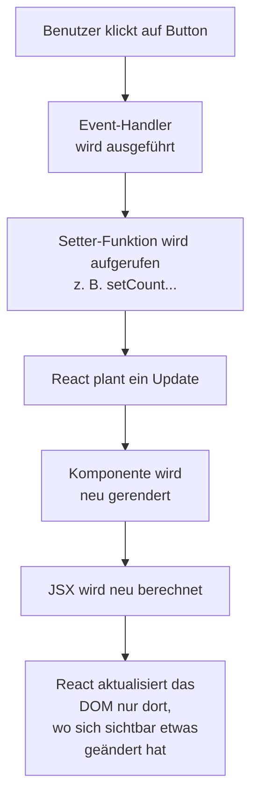
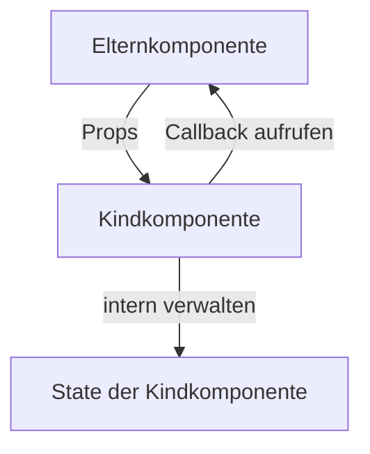

###### Themen

State in React

- Was ist State?
- Einführung in useState
- State verändern und Re-Rendering verstehen
- Unterschied zwischen Props und State

Bedingte Darstellung

- JSX mit Bedingungen (if / else, Ternary Operator, &&)
- Inhalte abhängig von State anzeigen oder ausblenden

# 🧠 State in React


## ❓ Was ist State?

In React ist **State** der **interne, veränderliche Speicher einer Komponente**. Damit merkt sich eine Komponente Dinge, die sich im Laufe der Benutzung ändern können, zum Beispiel:

- ob ein Menü geöffnet ist,
- welcher Text in ein Eingabefeld geschrieben wurde,
- wie oft ein Button geklickt wurde,
- ob Daten gerade geladen werden.

State ist also alles, was **nicht fest von außen kommt**, sondern sich **innerhalb der Komponente über die Zeit verändert**. React beschreibt State als ein „Gedächtnis“ einer Komponente, das zwischen Render-Durchläufen erhalten bleibt ([State: A Component’s Memory](https://react.dev/learn/state-a-components-memory)).

Wichtig ist: Eine React-Komponente ist im Kern einfach eine Funktion. Eine normale JavaScript-Funktion „merkt“ sich bei jedem neuen Aufruf nichts aus dem vorherigen Aufruf. Wenn du aber in einer React-Komponente State verwendest, sorgt React dafür, dass dieser Wert **zwischen mehreren Rendern gespeichert bleibt** ([State: A Component’s Memory](https://react.dev/learn/state-a-components-memory)).

Schauen wir uns den Gedanken an einem einfachen Beispiel an. Stell dir einen Zähler vor:

```jsx
function Counter() {
  let count = 0;

  function handleClick() {
    count = count + 1;
    console.log(count);
  }

  return <button onClick={handleClick}>Klicks: {count}</button>;
}
```

Hier sieht es auf den ersten Blick so aus, als würde `count` steigen. Tatsächlich gibt es aber ein Problem: React rendert die Komponente neu, und beim nächsten Render wird `count` wieder auf `0` gesetzt. Eine normale Variable reicht also nicht aus, wenn sich eine Änderung auch **im UI sichtbar auswirken** und **gespeichert bleiben** soll.

Genau dafür gibt es State.

State hat in React zwei zentrale Aufgaben:

1. **Wert speichern**  
   React merkt sich den Wert zwischen den Rendern.

2. **UI aktualisieren**  
   Wenn sich State ändert, rendert React die Komponente erneut, damit die Oberfläche den neuen Stand zeigt ([State: A Component’s Memory](https://react.dev/learn/state-a-components-memory)).

Ein typisches Beispiel:

```jsx
import { useState } from "react";

function Counter() {
  const [count, setCount] = useState(0);

  return (
    <button onClick={() => setCount(count + 1)}>
      Klicks: {count}
    </button>
  );
}
```

Hier passiert etwas Entscheidendes:

- `count` ist der aktuelle State-Wert.
- `setCount` ist die Funktion, mit der du den State änderst.
- `useState(0)` sagt: „Der Startwert ist 0.“

Sobald `setCount(...)` aufgerufen wird, merkt React: Der Zustand hat sich geändert. Dann wird die Komponente neu berechnet und mit dem neuen Wert angezeigt ([useState](https://react.dev/reference/react/useState)).

State ist also immer dann sinnvoll, wenn ein Wert:

- **für die Darstellung wichtig ist** und
- **sich ändern kann**.

Wenn ein Wert sich zwar ändert, aber **nicht** für das Rendern gebraucht wird, dann muss er nicht unbedingt State sein. In solchen Fällen ist manchmal eine normale Variable oder `useRef` passender. Für deine aktuellen Themen ist aber vor allem wichtig: **Sobald eine Änderung im JSX sichtbar werden soll, ist State oft das richtige Werkzeug.**


<br><br><br>
## ⚙️ Einführung in `useState`

`useState` ist ein **Hook**. Hooks sind spezielle React-Funktionen, mit denen Funktionskomponenten React-Funktionen wie State oder andere Mechanismen nutzen können ([Hooks](https://react.dev/reference/react/hooks)).

Die Grundform sieht so aus:

```jsx
const [wert, setWert] = useState(startwert);
```

Das sieht am Anfang ungewohnt aus, ist aber leicht zu verstehen:

- `wert` ist der aktuelle Zustand,
- `setWert` ist die Funktion zum Ändern,
- `useState(startwert)` legt den Anfangswert fest.

Ein ganz einfaches Beispiel:

```jsx
import { useState } from "react";

function LikeButton() {
  const [likes, setLikes] = useState(0);

  return (
    <button onClick={() => setLikes(likes + 1)}>
      Likes: {likes}
    </button>
  );
}
```

Beim ersten Render ist `likes` gleich `0`. Wenn du klickst, wird `setLikes(likes + 1)` ausgeführt. React speichert den neuen Wert und rendert die Komponente erneut. Danach steht dort `1`, dann `2`, dann `3` und so weiter ([useState](https://react.dev/reference/react/useState)).

### 🔍 Warum steht `useState` in eckigen Klammern?

Der Rückgabewert von `useState` ist ein Array mit genau zwei Einträgen:

```jsx
const ergebnis = useState(0);
```

Vereinfacht gedacht:

```jsx
[
  0,
  function zumAendern() { ... }
]
```

Mit **Array-Destructuring** holst du dir diese beiden Werte direkt heraus:

```jsx
const [count, setCount] = useState(0);
```

Das ist einfach nur moderne JavaScript-Syntax.

### 🏁 Der Anfangswert

Der Wert in `useState(...)` ist der **Initialwert**, also der Wert beim ersten Render. React verwendet diesen Anfangswert nicht bei jedem neuen Render erneut, sondern nur beim ersten Erzeugen dieses States ([useState](https://react.dev/reference/react/useState)).

```jsx
const [name, setName] = useState("Anna");
```

Hier startet `name` mit `"Anna"`.

State kann viele Datentypen speichern:

```jsx
const [count, setCount] = useState(0); // Zahl
const [name, setName] = useState(""); // String
const [isOpen, setIsOpen] = useState(false); // Boolean
const [items, setItems] = useState([]); // Array
const [user, setUser] = useState({ name: "Anna", age: 25 }); // Objekt
```

### 🧩 Mehrere State-Werte in einer Komponente

Du kannst mehrere `useState`-Aufrufe in derselben Komponente verwenden:

```jsx
import { useState } from "react";

function Profile() {
  const [name, setName] = useState("Anna");
  const [age, setAge] = useState(25);
  const [isOnline, setIsOnline] = useState(true);

  return (
    <div>
      <p>Name: {name}</p>
      <p>Alter: {age}</p>
      <p>Status: {isOnline ? "online" : "offline"}</p>

      <button onClick={() => setAge(age + 1)}>Geburtstag</button>
      <button onClick={() => setIsOnline(!isOnline)}>
        Status wechseln
      </button>
    </div>
  );
}
```

Das ist oft besser, als völlig unterschiedliche Dinge in ein einziges großes Objekt zu packen. React empfiehlt, State so zu strukturieren, dass zusammengehörige Daten zusammenbleiben und unnötige Komplexität vermieden wird ([Choosing the State Structure](https://react.dev/learn/choosing-the-state-structure)).

### 🧠 State aus vorherigem State berechnen

Wenn der neue State vom alten State abhängt, ist die sogenannte **Updater-Funktion** oft die sauberste Lösung:

```jsx
setCount(prevCount => prevCount + 1);
```

Warum ist das gut? Weil React State-Updates in eine Warteschlange stellen und zusammenfassen kann. Die Updater-Funktion bekommt dabei zuverlässig den aktuellsten vorherigen Wert ([Queueing a Series of State Updates](https://react.dev/learn/queueing-a-series-of-state-updates)).

Beispiel:

```jsx
function Counter() {
  const [count, setCount] = useState(0);

  function handleClick() {
    setCount(prev => prev + 1);
    setCount(prev => prev + 1);
    setCount(prev => prev + 1);
  }

  return <button onClick={handleClick}>Klicks: {count}</button>;
}
```

Nach einem Klick erhöht sich der Wert hier um `3`, weil jede Updater-Funktion den jeweils neuesten Zwischenstand erhält ([Queueing a Series of State Updates](https://react.dev/learn/queueing-a-series-of-state-updates)).

Wenn du stattdessen dreimal `setCount(count + 1)` schreiben würdest, arbeitest du dreimal mit demselben alten `count` aus diesem Render-Durchlauf. Das führt oft nicht zum erwarteten Ergebnis.

### 🚫 State nicht direkt verändern

Ein sehr wichtiger Punkt: Du darfst State **nicht direkt verändern**.

Falsch:

```jsx
count = count + 1;
```

oder bei Objekten:

```jsx
user.name = "Max";
```

oder bei Arrays:

```jsx
items.push("Neu");
```

Warum ist das problematisch? React erkennt Änderungen zuverlässig, wenn du die **Setter-Funktion** benutzt und bei Objekten oder Arrays **neue Werte erzeugst**, statt bestehende zu verändern ([Updating Objects in State](https://react.dev/learn/updating-objects-in-state), [Updating Arrays in State](https://react.dev/learn/updating-arrays-in-state)).

Richtig wäre zum Beispiel:

```jsx
setCount(count + 1);
```

Bei Objekten:

```jsx
setUser({
  ...user,
  name: "Max"
});
```

Bei Arrays:

```jsx
setItems([...items, "Neu"]);
```

Der Grundgedanke lautet: **State in React wird als unveränderlich behandelt**. Du ersetzt den alten Wert durch einen neuen, statt ihn heimlich zu verändern ([Updating Objects in State](https://react.dev/learn/updating-objects-in-state)).


<br><br><br>
## 🔄 State verändern und Re-Rendering verstehen

Wenn sich State ändert, rendert React die betroffene Komponente erneut. Dieses erneute Berechnen nennt man **Re-Rendering** ([Render and Commit](https://react.dev/learn/render-and-commit)).

Das ist einer der wichtigsten Mechanismen in React überhaupt.

### 🪜 Wie läuft eine State-Änderung ab?

Wenn du `setState` beziehungsweise bei `useState` die Setter-Funktion wie `setCount(...)` aufrufst, passiert grob Folgendes:



React trennt dabei vereinfacht gesagt zwischen dem **Berechnen**, wie die Oberfläche aussehen soll, und dem **Übertragen** der tatsächlichen Änderungen ins DOM. Dieser Ablauf wird in der React-Dokumentation als „Render“ und „Commit“ erklärt ([Render and Commit](https://react.dev/learn/render-and-commit)).

### 👀 Ein einfaches Beispiel

```jsx
import { useState } from "react";

function Counter() {
  const [count, setCount] = useState(0);

  console.log("Komponente rendert");

  return (
    <div>
      <p>Aktueller Wert: {count}</p>
      <button onClick={() => setCount(count + 1)}>
        Erhöhen
      </button>
    </div>
  );
}
```

Beim ersten Anzeigen der Komponente wird sie gerendert. Wenn du den Button klickst:

1. Der Klick löst `onClick` aus.
2. `setCount(count + 1)` wird aufgerufen.
3. React merkt sich den neuen State.
4. `Counter()` wird erneut ausgeführt.
5. Das JSX wird mit dem neuen `count` berechnet.
6. Im Browser wird nur der Teil aktualisiert, der sich sichtbar geändert hat.

Das heißt: React baut nicht blind „die ganze Seite neu“, sondern aktualisiert gezielt, was anders ist ([Render and Commit](https://react.dev/learn/render-and-commit)).

### ⏱️ Warum ist State nicht sofort „sichtbar“ geändert?

Viele Einsteiger wundern sich über so etwas:

```jsx
function handleClick() {
  setCount(count + 1);
  console.log(count);
}
```

Hier zeigt `console.log(count)` oft noch den alten Wert. Das liegt daran, dass das Setzen von State nicht bedeutet: „ändere die Variable sofort in dieser Zeile“. Stattdessen **fordert** du React auf, den State für den nächsten Render zu aktualisieren ([State as a Snapshot](https://react.dev/learn/state-as-a-snapshot)).

React beschreibt State deshalb als eine Art **Momentaufnahme**. Innerhalb eines bestimmten Render-Durchlaufs arbeitest du mit den Werten dieses Durchlaufs. Der neue State steht dann beim nächsten Render zur Verfügung ([State as a Snapshot](https://react.dev/learn/state-as-a-snapshot)).

### 📸 State als Schnappschuss verstehen

Dieses Bild hilft sehr:

- Jeder Render bekommt seine **eigene Momentaufnahme** des States.
- Event-Handler, die in diesem Render erstellt wurden, greifen auf genau diese Werte zu.
- Ein `setState` stößt einen neuen Render mit einer neuen Momentaufnahme an.

Beispiel:

```jsx
import { useState } from "react";

function Example() {
  const [number, setNumber] = useState(0);

  return (
    <button
      onClick={() => {
        setNumber(number + 1);
        setNumber(number + 1);
        setNumber(number + 1);
      }}
    >
      {number}
    </button>
  );
}
```

Hier wird nicht automatisch auf `3` erhöht, weil alle drei Aufrufe mit demselben `number` aus demselben Render arbeiten. Für solche Fälle solltest du die funktionale Schreibweise nutzen:

```jsx
onClick={() => {
  setNumber(n => n + 1);
  setNumber(n => n + 1);
  setNumber(n => n + 1);
}}
```

Dann wird korrekt dreimal erhöht ([Queueing a Series of State Updates](https://react.dev/learn/queueing-a-series-of-state-updates)).

### 🧱 Re-Rendering heißt nicht automatisch komplettes Neuzeichnen des Browsers

Es ist wichtig, zwei Dinge nicht zu verwechseln:

- **Die Komponente wird neu ausgeführt**  
  React ruft die Funktion erneut auf.

- **Das echte DOM wird nur bei Bedarf angepasst**  
  React vergleicht, was sich sichtbar geändert hat, und aktualisiert nur diese Stellen ([Render and Commit](https://react.dev/learn/render-and-commit)).

Das macht React effizient.

### 🧼 Warum direkte Mutation problematisch ist

Wenn du State direkt veränderst, zum Beispiel ein Objekt oder Array manipulierst, kann es sein, dass React die Änderung nicht so verarbeitet, wie du es erwartest. React geht davon aus, dass du bei Änderungen einen **neuen Wert** erzeugst. Deshalb sollst du bei Objekten und Arrays immer neue Strukturen zurückgeben ([Updating Objects in State](https://react.dev/learn/updating-objects-in-state), [Updating Arrays in State](https://react.dev/learn/updating-arrays-in-state)).

Falsch:

```jsx
user.name = "Lisa";
setUser(user);
```

Sauber:

```jsx
setUser({
  ...user,
  name: "Lisa"
});
```

Hier entsteht ein neues Objekt. Das ist die React-typische Denkweise.

### 🛑 Was passiert, wenn der neue State gleich dem alten ist?

Wenn du denselben Wert erneut setzt, kann React das Re-Rendering überspringen. React vergleicht den neuen und alten State mit `Object.is` ([useState](https://react.dev/reference/react/useState)).

Beispiel:

```jsx
setCount(5);
setCount(5);
```

Wenn `count` schon `5` ist, hat React unter Umständen nichts sichtbar zu ändern.

### 📊 Typische Denkfehler beim Re-Rendering

| Denkfehler | Was tatsächlich passiert |
|---|---|
| „State ist einfach nur eine normale Variable.“ | Nein. State wird von React zwischen Rendern gespeichert. |
| „Nach `setState` ist der Wert sofort in derselben Zeile neu.“ | Nein. Der neue Wert gilt für den nächsten Render. |
| „Re-Rendering bedeutet, dass alles im Browser komplett neu aufgebaut wird.“ | Nein. React berechnet neu und aktualisiert das DOM gezielt. |
| „Ich kann Arrays und Objekte im State direkt verändern.“ | Besser nicht. Du solltest neue Werte erzeugen. |


<br><br><br>
## 🆚 Unterschied zwischen Props und State

**Props** und **State** sind zwei verschiedene Wege, wie React-Komponenten mit Daten arbeiten.

Der grundlegende Unterschied lautet:

- **Props** kommen **von außen** in eine Komponente hinein.
- **State** gehört **der Komponente selbst** und kann sich dort ändern.

React beschreibt Props als Werte, die an Komponenten übergeben werden, ähnlich wie Funktionsargumente ([Passing Props to a Component](https://react.dev/learn/passing-props-to-a-component)).

### 📦 Props einfach erklärt

Props sind Eingabewerte einer Komponente.

```jsx
function Greeting(props) {
  return <h1>Hallo, {props.name}!</h1>;
}
```

Verwendung:

```jsx
<Greeting name="Anna" />
```

Hier bekommt `Greeting` den Wert `"Anna"` von außen. Die Komponente selbst hat diesen Wert nicht erzeugt.

### 🧠 State einfach erklärt

State ist das interne Gedächtnis einer Komponente.

```jsx
import { useState } from "react";

function Counter() {
  const [count, setCount] = useState(0);

  return (
    <button onClick={() => setCount(count + 1)}>
      {count}
    </button>
  );
}
```

Hier lebt `count` innerhalb der Komponente selbst.

### ⚖️ Props und State im direkten Vergleich

| Merkmal | Props | State |
|---|---|---|
| Herkunft | Von einer Elternkomponente | Innerhalb der Komponente |
| Änderbar durch die Komponente selbst? | Nein, nicht direkt | Ja, über Setter wie `setState` |
| Zweck | Daten nach unten weitergeben | Veränderungen innerhalb der Komponente verwalten |
| Vergleichbar mit | Funktionsargumenten | Internem Speicher / Gedächtnis |
| Beispiel | `title="Startseite"` | `isOpen`, `count`, `inputValue` |

Props sind in React **schreibgeschützt**. Eine Komponente soll Props nicht verändern. React erwartet, dass Komponenten in Bezug auf Props wie reine Funktionen arbeiten ([Keeping Components Pure](https://react.dev/learn/keeping-components-pure)).

Das heißt: Wenn eine Komponente neue Daten braucht, dann bekommt sie neue Props von oben. Wenn sie ihren internen Zustand ändern will, nutzt sie State.

### 🏠 Ein praktisches Beispiel

```jsx
import { useState } from "react";

function Counter({ startValue }) {
  const [count, setCount] = useState(startValue);

  return (
    <button onClick={() => setCount(count + 1)}>
      Aktuell: {count}
    </button>
  );
}
```

Verwendung:

```jsx
<Counter startValue={10} />
```

Hier sieht man beide Konzepte zusammen:

- `startValue` ist eine **Prop**. Sie kommt von außen.
- `count` ist **State**. Er wird in der Komponente gespeichert.
- `useState(startValue)` nimmt die Prop als Anfangswert für den State.

Wichtig dabei: Der Initialwert von `useState` wird nur beim ersten Render verwendet. Wenn sich `startValue` später ändert, passt sich `count` nicht automatisch daran an ([useState](https://react.dev/reference/react/useState)). Das ist ein häufiger Stolperstein.

### 🔁 Datenfluss in React

React arbeitet grundsätzlich mit einem **einseitigen Datenfluss**:

- Daten kommen über Props von oben nach unten.
- Interne Änderungen einer Komponente laufen über State.
- Wenn Kinder etwas „nach oben melden“ sollen, passiert das meistens über Callback-Props, also Funktionen, die von oben übergeben werden ([Passing Props to a Component](https://react.dev/learn/passing-props-to-a-component)).

Eine kleine Darstellung:



### 🧭 Wann Props, wann State?

Ein guter Merksatz ist:

- **Props**: „Das bekomme ich.“
- **State**: „Das verwalte ich selbst.“

Wenn eine Information von einer anderen Komponente kommt, ist sie normalerweise eine Prop. Wenn eine Information sich durch Interaktion innerhalb der Komponente ändert, ist sie oft State.

Beispiele:

- Der Titel einer Seite, den die Elternkomponente festlegt → **Prop**
- Ob ein Akkordeon gerade geöffnet ist → **State**
- Die Liste von Daten, die von oben weitergereicht wird → **Prop**
- Der aktuelle Text in einem Suchfeld → **State**

### 🚨 Häufige Verwechslung

Ein typischer Fehler ist, Props in State zu kopieren, obwohl das gar nicht nötig ist.

Beispiel:

```jsx
function UserCard({ name }) {
  const [userName, setUserName] = useState(name);

  return <p>{userName}</p>;
}
```

Das wirkt erstmal harmlos, kann aber problematisch werden. Wenn sich die Prop `name` ändert, ändert sich `userName` nicht automatisch mit. React rät dazu, redundanten oder abgeleiteten State möglichst zu vermeiden ([Choosing the State Structure](https://react.dev/learn/choosing-the-state-structure)).

Wenn du einen Prop-Wert einfach nur anzeigen willst, dann verwende ihn direkt:

```jsx
function UserCard({ name }) {
  return <p>{name}</p>;
}
```

State solltest du nur dann anlegen, wenn die Komponente diesen Wert **wirklich eigenständig verändern oder merken** muss.


<br><br><br>
# 🎭 Bedingte Darstellung


## 🧩 JSX mit Bedingungen (`if / else`, ternärer Operator, `&&`)

**Bedingte Darstellung** bedeutet: Du zeigst in React Inhalte **abhängig von einer Bedingung** an. Das ist ein ganz normaler Teil von Benutzeroberflächen. Zum Beispiel:

- Ein Ladehinweis wird nur angezeigt, wenn Daten noch geladen werden.
- Ein Button zeigt „Anmelden“ oder „Abmelden“.
- Eine Fehlermeldung erscheint nur bei einem Fehler.
- Ein Bereich wird nur für eingeloggte Benutzer sichtbar.

React nutzt dafür ganz normale JavaScript-Logik. Die React-Dokumentation betont ausdrücklich, dass du in React keine spezielle Template-Sprache für Bedingungen lernst, sondern normales JavaScript in JSX verwendest ([Conditional Rendering](https://react.dev/learn/conditional-rendering)).

### 🔀 `if / else` verwenden

Mit `if / else` arbeitest du meist **vor dem `return`**. Das ist besonders gut, wenn sich größere JSX-Blöcke unterscheiden.

Beispiel:

```jsx
function LoginStatus({ isLoggedIn }) {
  if (isLoggedIn) {
    return <p>Du bist eingeloggt.</p>;
  } else {
    return <p>Du bist nicht eingeloggt.</p>;
  }
}
```

Das ist sehr klar lesbar. Vor allem dann, wenn du komplett unterschiedliche Inhalte zurückgeben willst.

Du kannst auch `if` ohne `else` verwenden und frühzeitig zurückgeben:

```jsx
function Warning({ hasError }) {
  if (hasError) {
    return <p>Es ist ein Fehler aufgetreten.</p>;
  }

  return <p>Alles in Ordnung.</p>;
}
```

Diese Form ist oft angenehm, weil sie die Logik deutlich macht.

### ⚖️ Der ternäre Operator

Der **ternäre Operator** ist eine kompakte Schreibweise für einfache Bedingungen direkt im JSX:

```jsx
bedingung ? ausdruckWennWahr : ausdruckWennFalsch
```

Beispiel:

```jsx
function LoginStatus({ isLoggedIn }) {
  return (
    <p>{isLoggedIn ? "Du bist eingeloggt." : "Du bist nicht eingeloggt."}</p>
  );
}
```

Das ist besonders praktisch, wenn du nur zwischen zwei kurzen Varianten umschalten willst.

Auch ganze Elemente lassen sich so austauschen:

```jsx
function Button({ isLoggedIn }) {
  return (
    <button>
      {isLoggedIn ? "Abmelden" : "Anmelden"}
    </button>
  );
}
```

Wichtig ist: Der ternäre Operator bleibt gut lesbar, solange er nicht zu verschachtelt wird. Wenn Bedingungen komplex werden, ist `if / else` oft die sauberere Wahl.

### ✅ `&&` für „zeige nur wenn wahr“

Wenn du etwas **nur dann rendern willst, wenn eine Bedingung wahr ist**, kannst du den logischen UND-Operator `&&` verwenden:

```jsx
function Inbox({ hasMessages }) {
  return (
    <div>
      <h1>Posteingang</h1>
      {hasMessages && <p>Du hast neue Nachrichten.</p>}
    </div>
  );
}
```

Hier gilt:

- Wenn `hasMessages` `true` ist, wird das `<p>` gerendert.
- Wenn `hasMessages` `false` ist, rendert React nichts an dieser Stelle ([Conditional Rendering](https://react.dev/learn/conditional-rendering)).

Das ist eine sehr beliebte Schreibweise für optionale Inhalte.

### ⚠️ Vorsicht bei `&&` mit Zahlen

Ein wichtiger Sonderfall: In JavaScript gibt `0 && <Element />` den Wert `0` zurück. React rendert Zahlen, also könnte dann tatsächlich eine `0` im UI erscheinen ([Conditional Rendering](https://react.dev/learn/conditional-rendering)).

Problematisches Beispiel:

```jsx
function MessageCount({ count }) {
  return (
    <div>
      {count && <p>Du hast Nachrichten.</p>}
    </div>
  );
}
```

Wenn `count` gleich `0` ist, erscheint unter Umständen `0` statt gar nichts.

Besser:

```jsx
function MessageCount({ count }) {
  return (
    <div>
      {count > 0 && <p>Du hast Nachrichten.</p>}
    </div>
  );
}
```

Oder mit ternärem Operator:

```jsx
function MessageCount({ count }) {
  return (
    <div>
      {count > 0 ? <p>Du hast Nachrichten.</p> : null}
    </div>
  );
}
```

### 🚫 `null` zurückgeben

Wenn eine Komponente gar nichts anzeigen soll, kannst du `null` zurückgeben:

```jsx
function Warning({ show }) {
  if (!show) {
    return null;
  }

  return <p>Achtung!</p>;
}
```

`null` bedeutet in React: **Rendere nichts** ([Conditional Rendering](https://react.dev/learn/conditional-rendering)).

Das ist oft nützlich, wenn ein ganzer Bereich unter bestimmten Bedingungen verborgen bleiben soll.

### 🧠 Welche Variante wann?

| Situation | Gute Wahl |
|---|---|
| Zwei komplett unterschiedliche Rückgaben | `if / else` |
| Kurze Entscheidung direkt im JSX | ternärer Operator |
| Optionalen Inhalt nur bei `true` zeigen | `&&` |
| Gar nichts rendern | `null` |

### 🧱 Bedingungen in JSX sind einfach JavaScript

Das Wichtigste ist: In JSX schreibst du keine „magische React-Syntax“, sondern normale JavaScript-Ausdrücke in geschweiften Klammern.

Zum Beispiel:

```jsx
function UserInfo({ user }) {
  return (
    <div>
      <h2>{user.name}</h2>
      <p>{user.isAdmin ? "Administrator" : "Benutzer"}</p>
    </div>
  );
}
```

Die geschweiften Klammern `{ ... }` bedeuten: „Hier kommt ein JavaScript-Ausdruck hinein.“

### 🛑 Was in JSX nicht direkt geht

Ein häufiger Punkt: `if` ist eine Anweisung, kein Ausdruck. Deshalb kannst du nicht einfach so mitten in JSX schreiben:

```jsx
return (
  <div>
    {if (isLoggedIn) { ... }}
  </div>
);
```

Das ist ungültig. Wenn du `if` nutzen willst, machst du das vor dem `return` oder lagerst JSX in Variablen aus.

Zum Beispiel:

```jsx
function Status({ isLoggedIn }) {
  let content;

  if (isLoggedIn) {
    content = <p>Willkommen zurück!</p>;
  } else {
    content = <p>Bitte melde dich an.</p>;
  }

  return <div>{content}</div>;
}
```

Auch das ist eine saubere und gut lesbare Technik.


<br><br><br>
## 👁️ Inhalte abhängig von State anzeigen oder ausblenden

Eine der häufigsten Anwendungen von State ist, dass Inhalte abhängig vom aktuellen Zustand sichtbar oder unsichtbar werden. Genau hier arbeiten **State** und **bedingte Darstellung** direkt zusammen.

Das Grundprinzip ist einfach:

1. Eine Komponente speichert einen Zustand, zum Beispiel `isOpen`.
2. Benutzerinteraktionen ändern diesen Zustand.
3. Das JSX prüft den Zustand.
4. Je nach Zustand wird etwas angezeigt oder verborgen.

### 🚪 Einfaches Beispiel: Bereich ein- und ausblenden

```jsx
import { useState } from "react";

function InfoBox() {
  const [isOpen, setIsOpen] = useState(false);

  return (
    <div>
      <button onClick={() => setIsOpen(!isOpen)}>
        {isOpen ? "Ausblenden" : "Anzeigen"}
      </button>

      {isOpen && (
        <p>
          Das ist ein zusätzlicher Informationsbereich.
        </p>
      )}
    </div>
  );
}
```

So funktioniert das:

- `isOpen` startet mit `false`.
- Dadurch wird der Absatz zunächst nicht angezeigt.
- Beim Klick wird `setIsOpen(!isOpen)` aufgerufen.
- Der State ändert sich auf `true`.
- React rendert neu.
- Jetzt ist die Bedingung wahr und der Absatz wird eingeblendet.

Das ist ein sehr typisches React-Muster.

### 🔁 Sichtbarkeit umschalten

Ein Boolean-State wie `true`/`false` ist ideal für Dinge wie:

- Modal offen oder geschlossen
- Menü sichtbar oder verborgen
- Passwort sichtbar oder versteckt
- Details ausgeklappt oder eingeklappt
- Ladeanzeige ein oder aus

Beispiel mit Updater-Funktion:

```jsx
import { useState } from "react";

function TogglePanel() {
  const [isVisible, setIsVisible] = useState(false);

  function handleToggle() {
    setIsVisible(prev => !prev);
  }

  return (
    <section>
      <button onClick={handleToggle}>
        {isVisible ? "Details verbergen" : "Details zeigen"}
      </button>

      {isVisible ? (
        <div>
          <h2>Details</h2>
          <p>Hier stehen zusätzliche Informationen.</p>
        </div>
      ) : null}
    </section>
  );
}
```

Die Schreibweise `prev => !prev` ist hier besonders sauber, weil der neue Wert direkt aus dem vorherigen Zustand berechnet wird ([useState](https://react.dev/reference/react/useState)).

### 🔐 Inhalte abhängig vom Anmeldestatus

Ein weiteres klassisches Muster:

```jsx
function UserArea() {
  const [isLoggedIn, setIsLoggedIn] = useState(false);

  return (
    <div>
      <button onClick={() => setIsLoggedIn(prev => !prev)}>
        {isLoggedIn ? "Abmelden" : "Anmelden"}
      </button>

      {isLoggedIn ? (
        <p>Willkommen im geschützten Bereich.</p>
      ) : (
        <p>Bitte melde dich an, um den Inhalt zu sehen.</p>
      )}
    </div>
  );
}
```

Hier steuert State nicht nur, **ob** etwas sichtbar ist, sondern auch **welcher** Inhalt gezeigt wird.

### ⏳ Ladezustände anzeigen

State wird sehr oft genutzt, um Ladehinweise oder Fehlermeldungen ein- und auszublenden.

```jsx
import { useState } from "react";

function DataView() {
  const [isLoading, setIsLoading] = useState(true);

  return (
    <div>
      {isLoading ? <p>Daten werden geladen...</p> : <p>Daten sind fertig geladen.</p>}
    </div>
  );
}
```

In echten Anwendungen würde `isLoading` oft durch einen Datenabruf verändert werden. Das Prinzip ist aber immer gleich: **Der State entscheidet, was gerendert wird.**

### 🧾 Formularhinweise anzeigen

Auch Formular-Feedback lässt sich so umsetzen:

```jsx
import { useState } from "react";

function PasswordField() {
  const [showHint, setShowHint] = useState(false);

  return (
    <div>
      <input
        type="password"
        onFocus={() => setShowHint(true)}
        onBlur={() => setShowHint(false)}
      />

      {showHint && (
        <p>Das Passwort sollte mindestens 8 Zeichen lang sein.</p>
      )}
    </div>
  );
}
```

Hier hängt die Anzeige des Hinweises direkt vom State ab.

### 🧠 Warum dieses Muster so wichtig ist

In React gilt der Grundsatz: **Die Benutzeroberfläche ist eine Funktion des States.** Wenn sich der State ändert, ergibt sich daraus automatisch eine neue Darstellung ([Thinking in React](https://react.dev/learn/thinking-in-react)).

Das ist der große Vorteil von React:

- Du manipulierst nicht manuell das DOM.
- Du sagst nicht: „verstecke dieses Element jetzt mit `document.querySelector(...).style.display = 'none'`“.
- Stattdessen beschreibst du: „Wenn `isOpen` wahr ist, zeige diesen Bereich. Sonst nicht.“

React kümmert sich dann um die Aktualisierung der Oberfläche.

### 🧭 Typische Muster zum Anzeigen oder Ausblenden

| Ziel | Typischer State | Typische JSX-Bedingung |
|---|---|---|
| Menü auf/zu | `isMenuOpen` | `{isMenuOpen && <Menu />}` |
| Modal sichtbar | `isModalOpen` | `{isModalOpen ? <Modal /> : null}` |
| Laden läuft | `isLoading` | `{isLoading ? <Spinner /> : <Content />}` |
| Fehlermeldung anzeigen | `hasError` | `{hasError && <ErrorMessage />}` |
| Benutzer ist eingeloggt | `isLoggedIn` | `{isLoggedIn ? <Dashboard /> : <LoginForm />}` |

### 🧱 Beispiel mit mehreren Zuständen

Hier siehst du, wie mehrere State-Werte zusammen die Darstellung steuern:

```jsx
import { useState } from "react";

function Panel() {
  const [isOpen, setIsOpen] = useState(false);
  const [hasNotification, setHasNotification] = useState(true);

  return (
    <div>
      <button onClick={() => setIsOpen(prev => !prev)}>
        {isOpen ? "Panel schließen" : "Panel öffnen"}
      </button>

      <button onClick={() => setHasNotification(prev => !prev)}>
        Benachrichtigung umschalten
      </button>

      {hasNotification && <p>Du hast eine neue Benachrichtigung.</p>}

      {isOpen ? (
        <section>
          <h2>Panel-Inhalt</h2>
          <p>Dieser Bereich ist gerade sichtbar.</p>
        </section>
      ) : null}
    </div>
  );
}
```

Hier entscheiden zwei unterschiedliche Zustände unabhängig voneinander über zwei unterschiedliche Bereiche. Das zeigt gut, wie flexibel React mit State und Bedingungen arbeitet.

### ⚠️ Anzeigen/Ausblenden ist nicht dasselbe wie „nur per CSS verstecken“

Wenn du in React mit Bedingungen arbeitest, wird ein Element oft **gar nicht gerendert**, statt nur unsichtbar gemacht zu werden.

Beispiel:

```jsx
{isOpen && <Panel />}
```

Wenn `isOpen` `false` ist, gibt es dieses `Panel` in diesem Render gar nicht. Das ist etwas anderes, als ein Element mit CSS nur optisch zu verstecken. Für React bedeutet bedingte Darstellung also oft: **Element vorhanden oder nicht vorhanden**.

Das ist wichtig, weil dadurch auch das Verhalten beeinflusst wird, etwa Lebenszyklen, Fokus oder zurückgesetzte interne Zustände von Kindkomponenten, wenn sie entfernt und später neu eingefügt werden ([Conditional Rendering](https://react.dev/learn/conditional-rendering)).

### 🔍 Ein vollständiges, gut lesbares Beispiel

```jsx
import { useState } from "react";

function FAQItem() {
  const [isOpen, setIsOpen] = useState(false);

  return (
    <article>
      <button onClick={() => setIsOpen(prev => !prev)}>
        {isOpen ? "Antwort ausblenden" : "Antwort anzeigen"}
      </button>

      {isOpen && (
        <div>
          <h3>Was ist React-State?</h3>
          <p>
            State ist der veränderliche Speicher einer Komponente. Wenn sich
            State ändert, rendert React die Komponente neu und aktualisiert die
            Oberfläche entsprechend.
          </p>
        </div>
      )}
    </article>
  );
}
```

Dieses Beispiel verbindet fast alles aus dem Thema:

- `useState` speichert einen Boolean-Wert,
- ein Klick verändert den State,
- der neue State löst ein Re-Rendering aus,
- JSX entscheidet anhand des States, ob Inhalt erscheint oder verschwindet.