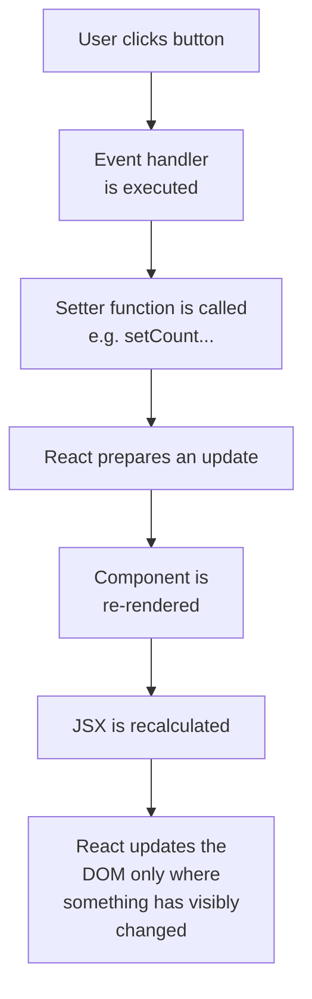
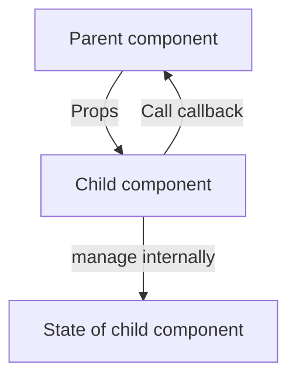

###### Topics

State in React

- What is State?
- Introduction to useState
- Updating State and understanding Re-Rendering
- Difference between Props and State

Conditional Rendering

- JSX with conditions (if / else, Ternary Operator, &&)
- Showing or hiding content based on State

# 🧠 State in React


## ❓ What is State?

In React, **State** is the **internal, changeable memory of a component**. This allows a component to remember things that can change during usage, for example:

- whether a menu is open,
- what text was entered into an input field,
- how many times a button was clicked,
- whether data is currently being loaded.

State is everything that **doesn’t come fixed from outside**, but instead **changes internally within the component over time**. React describes State as a component’s “memory” that is preserved between renders ([State: A Component’s Memory](https://react.dev/learn/state-a-components-memory)).

Important point: At its core, a React component is just a function. A regular JavaScript function does **not** remember anything from previous calls. But if you use State in a React component, React makes sure that this value is **saved between multiple renders** ([State: A Component’s Memory](https://react.dev/learn/state-a-components-memory)).

Let’s consider this with a simple example. Imagine a counter:

```jsx
function Counter() {
  let count = 0;

  function handleClick() {
    count = count + 1;
    console.log(count);
  }

  return <button onClick={handleClick}>Clicks: {count}</button>;
}
```

At first glance, it looks like `count` would increase. But actually there’s a problem: React re-renders the component, and at the next render, `count` is reset to `0`. So a regular variable is **not enough** if you want a change to be **visible in the UI** and **remain stored**.

That’s exactly what State is for.

State in React has two pivotal tasks:

1. **Storing the value**  
   React remembers the value between renders.

2. **Updating the UI**  
   When State changes, React re-renders the component so the UI shows the new state ([State: A Component’s Memory](https://react.dev/learn/state-a-components-memory)).

A typical example:

```jsx
import { useState } from "react";

function Counter() {
  const [count, setCount] = useState(0);

  return (
    <button onClick={() => setCount(count + 1)}>
      Clicks: {count}
    </button>
  );
}
```

Here’s what’s essential:

- `count` is the current state value.
- `setCount` is the function to update the state.
- `useState(0)` says: “The starting value is 0.”

As soon as `setCount(...)` is called, React notices the state has changed. Then the component is re-evaluated and displayed with the new value ([useState](https://react.dev/reference/react/useState)).

State is useful whenever a value:

- **is important for rendering** and
- **can change**.

If a value changes but does **not** affect rendering, it doesn’t necessarily have to be State. In those cases, a regular variable or `useRef` might be more appropriate. But for your current topics, the important point is: **Whenever a change should become visible in JSX, State is often the right tool.**


<br><br><br>
## ⚙️ Introduction to `useState`

`useState` is a **Hook**. Hooks are special React functions that allow function components to use React features like state or other mechanisms ([Hooks](https://react.dev/reference/react/hooks)).

The base form looks like this:

```jsx
const [value, setValue] = useState(initialValue);
```

At first, this might look strange but it’s simple:

- `value` is the current state,
- `setValue` is the function to change it,
- `useState(initialValue)` sets the initial value.

A simple example:

```jsx
import { useState } from "react";

function LikeButton() {
  const [likes, setLikes] = useState(0);

  return (
    <button onClick={() => setLikes(likes + 1)}>
      Likes: {likes}
    </button>
  );
}
```

At the first render, `likes` is `0`. When clicked, `setLikes(likes + 1)` is called. React stores the new value and re-renders the component. After that, it shows `1`, then `2`, then `3`, and so on ([useState](https://react.dev/reference/react/useState)).

### 🔍 Why is `useState` in square brackets?

The return value of `useState` is an array with exactly two entries:

```jsx
const result = useState(0);
```

Simply put:

```jsx
[
  0,
  function toChange() { ... }
]
```

With **array destructuring** you extract these two values right away:

```jsx
const [count, setCount] = useState(0);
```

This is just modern JavaScript syntax.

### 🏁 The initial value

The value in `useState(...)` is the **initial value**, the value at first render. React uses this starting value **only** the first time this state is created ([useState](https://react.dev/reference/react/useState)).

```jsx
const [name, setName] = useState("Anna");
```

Here, `name` starts at `"Anna"`.

State can store many data types:

```jsx
const [count, setCount] = useState(0); // Number
const [name, setName] = useState(""); // String
const [isOpen, setIsOpen] = useState(false); // Boolean
const [items, setItems] = useState([]); // Array
const [user, setUser] = useState({ name: "Anna", age: 25 }); // Object
```

### 🧩 Multiple state values in one component

You can use multiple `useState` calls in the same component:

```jsx
import { useState } from "react";

function Profile() {
  const [name, setName] = useState("Anna");
  const [age, setAge] = useState(25);
  const [isOnline, setIsOnline] = useState(true);

  return (
    <div>
      <p>Name: {name}</p>
      <p>Age: {age}</p>
      <p>Status: {isOnline ? "online" : "offline"}</p>

      <button onClick={() => setAge(age + 1)}>Birthday</button>
      <button onClick={() => setIsOnline(!isOnline)}>
        Toggle status
      </button>
    </div>
  );
}
```

This is often better than putting completely different things in one large object. React recommends structuring state so related data stays together and unnecessary complexity is avoided ([Choosing the State Structure](https://react.dev/learn/choosing-the-state-structure)).

### 🧠 Computing new state from previous state

When the new state depends on the previous state, the so-called **updater function** is often the cleanest solution:

```jsx
setCount(prevCount => prevCount + 1);
```

Why is this good? Because React can queue and batch state updates. The updater function reliably gets the latest previous value ([Queueing a Series of State Updates](https://react.dev/learn/queueing-a-series-of-state-updates)).

Example:

```jsx
function Counter() {
  const [count, setCount] = useState(0);

  function handleClick() {
    setCount(prev => prev + 1);
    setCount(prev => prev + 1);
    setCount(prev => prev + 1);
  }

  return <button onClick={handleClick}>Clicks: {count}</button>;
}
```

After one click, the value increases by `3` because each updater function receives the latest intermediate value ([Queueing a Series of State Updates](https://react.dev/learn/queueing-a-series-of-state-updates)).

If you instead wrote `setCount(count + 1)` three times, you’d work with the same old `count` from this render three times—that often doesn't produce the expected result.

### 🚫 Never mutate state directly

A very important point: You must **not mutate state directly**.

Incorrect:

```jsx
count = count + 1;
```

Or for objects:

```jsx
user.name = "Max";
```

Or for arrays:

```jsx
items.push("New");
```

Why is this problematic? React reliably detects changes when you use the **setter function** and **create new values** for objects or arrays instead of changing existing ones ([Updating Objects in State](https://react.dev/learn/updating-objects-in-state), [Updating Arrays in State](https://react.dev/learn/updating-arrays-in-state)).

Correct would be for example:

```jsx
setCount(count + 1);
```

For objects:

```jsx
setUser({
  ...user,
  name: "Max"
});
```

For arrays:

```jsx
setItems([...items, "New"]);
```

The guiding principle is: **State in React is treated as immutable**. You replace the old value with a new one, instead of secretly changing it ([Updating Objects in State](https://react.dev/learn/updating-objects-in-state)).


<br><br><br>
## 🔄 Updating state and understanding re-rendering

When state changes, React re-renders the affected component. This recalculation is called **re-rendering** ([Render and Commit](https://react.dev/learn/render-and-commit)).

This is one of the most important mechanisms in React.

### 🪜 What happens during a state update?

When you call `setState`, or in `useState` the setter function like `setCount(...)`, roughly the following happens:



React, simply put, separates **computing** what the UI should look like from **committing** the actual changes to the DOM. This process is described in React docs as “Render and Commit” ([Render and Commit](https://react.dev/learn/render-and-commit)).

### 👀 Simple example

```jsx
import { useState } from "react";

function Counter() {
  const [count, setCount] = useState(0);

  console.log("Component renders");

  return (
    <div>
      <p>Current value: {count}</p>
      <button onClick={() => setCount(count + 1)}>
        Increase
      </button>
    </div>
  );
}
```

At the first display, the component renders. When you click the button:

1. The click triggers `onClick`.
2. `setCount(count + 1)` is called.
3. React remembers the new state.
4. `Counter()` is executed again.
5. The JSX is recalculated with the new `count`.
6. In the browser, only the part that visually changed is updated.

That means: React does not “rebuild the whole page” blindly, but selectively updates only what is different ([Render and Commit](https://react.dev/learn/render-and-commit)).

### ⏱️ Why is state not “instantly” changed?

Many beginners are confused by code like this:

```jsx
function handleClick() {
  setCount(count + 1);
  console.log(count);
}
```

Here, `console.log(count)` often still logs the old value. That’s because setting state doesn’t mean: “change the variable immediately in this line.” Instead, you are **requesting** React to update the state for the next render ([State as a Snapshot](https://react.dev/learn/state-as-a-snapshot)).

React describes state as a kind of **snapshot**. Within a render, you work with the values from that render. The new state is available in the next render ([State as a Snapshot](https://react.dev/learn/state-as-a-snapshot)).

### 📸 Understanding state as a snapshot

This image helps:

- Each render has its **own snapshot** of the state.
- Event handlers created in that render access exactly that value.
- A `setState` triggers a new render with a new snapshot.

Example:

```jsx
import { useState } from "react";

function Example() {
  const [number, setNumber] = useState(0);

  return (
    <button
      onClick={() => {
        setNumber(number + 1);
        setNumber(number + 1);
        setNumber(number + 1);
      }}
    >
      {number}
    </button>
  );
}
```

Here the value doesn’t automatically increase by `3`, because all three calls use the same `number` from this render. In such cases you should use the functional form:

```jsx
onClick={() => {
  setNumber(n => n + 1);
  setNumber(n => n + 1);
  setNumber(n => n + 1);
}}
```

Then it increases by 3 as expected ([Queueing a Series of State Updates](https://react.dev/learn/queueing-a-series-of-state-updates)).

### 🧱 Re-rendering does not mean repainting the entire browser

It’s important not to confuse two things:

- **The component function executes again**  
  React calls the function again.

- **The real DOM is only updated if needed**  
  React compares what has changed and updates only those parts ([Render and Commit](https://react.dev/learn/render-and-commit)).

That’s what makes React efficient.

### 🧼 Why direct mutation is problematic

If you directly mutate state (e.g. modify an object or array), React might not process the change as you expect. React expects you to **produce a new value** for updates. That’s why for objects and arrays, you should always return new structures ([Updating Objects in State](https://react.dev/learn/updating-objects-in-state), [Updating Arrays in State](https://react.dev/learn/updating-arrays-in-state)).

Incorrect:

```jsx
user.name = "Lisa";
setUser(user);
```

Clean:

```jsx
setUser({
  ...user,
  name: "Lisa"
});
```

This creates a new object—that’s the React-typical way.

### 🛑 What happens if new state equals old state?

If you set the same value again, React can skip re-rendering. React compares the new and old state using `Object.is` ([useState](https://react.dev/reference/react/useState)).

Example:

```jsx
setCount(5);
setCount(5);
```

If `count` is already `5`, React may not perform a visible update.

### 📊 Common misconceptions about re-rendering

| Misconception | What actually happens |
|---|---|
| “State is just a normal variable.” | No. State is remembered by React between renders. |
| “After `setState` the value is instantly changed in the same line.” | No. The new value takes effect in the next render. |
| “Re-rendering means everything in the browser is rebuilt anew.” | No. React recalculates and updates the DOM selectively. |
| “I can mutate arrays and objects in state directly.” | Better not. You should create new values. |


<br><br><br>
## 🆚 Difference between Props and State

**Props** and **State** are two different ways React components work with data.

The fundamental difference is:

- **Props** come **from outside** into a component.
- **State** is **owned by the component itself** and can change there.

React describes Props as values passed to components, similar to function arguments ([Passing Props to a Component](https://react.dev/learn/passing-props-to-a-component)).

### 📦 Props simply explained

Props are input values for a component.

```jsx
function Greeting(props) {
  return <h1>Hello, {props.name}!</h1>;
}
```

Usage:

```jsx
<Greeting name="Anna" />
```

Here `Greeting` receives the value `"Anna"` from outside. The component itself didn’t generate this value.

### 🧠 State simply explained

State is a component’s internal memory.

```jsx
import { useState } from "react";

function Counter() {
  const [count, setCount] = useState(0);

  return (
    <button onClick={() => setCount(count + 1)}>
      {count}
    </button>
  );
}
```

Here, `count` lives inside the component itself.

### ⚖️ Props and State side by side

| Property | Props | State |
|---|---|---|
| Origin | From a parent component | Inside the component |
| Can the component itself change it? | No, not directly | Yes, via setter like `setState` |
| Purpose | Passing data downward | Managing changes within the component |
| Comparable to | Function arguments | Internal memory |
| Example | `title="Home"` | `isOpen`, `count`, `inputValue` |

Props in React are **read-only**. A component should not change its Props. React expects components to be pure with respect to Props ([Keeping Components Pure](https://react.dev/learn/keeping-components-pure)).

That means: If a component needs new data, it gets new Props from above. If it wants to update its internal state, it uses State.

### 🏠 Practical example

```jsx
import { useState } from "react";

function Counter({ startValue }) {
  const [count, setCount] = useState(startValue);

  return (
    <button onClick={() => setCount(count + 1)}>
      Current: {count}
    </button>
  );
}
```

Usage:

```jsx
<Counter startValue={10} />
```

Here you can see both concepts together:

- `startValue` is a **Prop**. It comes from outside.
- `count` is **State**. It is stored inside the component.
- `useState(startValue)` takes the Prop as an initial value for State.

Important: The initial value for `useState` is only used during the first render. If `startValue` changes later, `count` does **not** adjust automatically ([useState](https://react.dev/reference/react/useState)). This is a common pitfall.

### 🔁 Data flow in React

React basically operates with **one-way data flow**:

- Data comes from top to bottom through Props.
- Internal changes of a component are managed via State.
- If a child needs to “notify upwards”, this usually happens through callback Props, i.e., functions passed from above ([Passing Props to a Component](https://react.dev/learn/passing-props-to-a-component)).

A little diagram:



### 🧭 When to use Props, when State?

A good rule of thumb:

- **Props**: “This is what I receive.”
- **State**: “This is what I manage myself.”

If information comes from another component, it’s usually a Prop. If it changes due to internal interaction, it’s often State.

Examples:

- The title of a page, set by the parent → **Prop**
- Whether an accordion is open → **State**
- A list of data passed from above → **Prop**
- The current text in a search field → **State**

### 🚨 Common confusion

A typical mistake is to copy Props into State even when not necessary.

Example:

```jsx
function UserCard({ name }) {
  const [userName, setUserName] = useState(name);

  return <p>{userName}</p>;
}
```

This may look harmless but it can cause problems. If the Prop `name` changes, `userName` does **not** update automatically. React recommends avoiding redundant or derived state when possible ([Choosing the State Structure](https://react.dev/learn/choosing-the-state-structure)).

If you just want to display a Prop value, use it directly:

```jsx
function UserCard({ name }) {
  return <p>{name}</p>;
}
```

State should only be used when the component genuinely needs to **manage or remember** the value itself.


<br><br><br>
# 🎭 Conditional Rendering


## 🧩 JSX with conditions (`if / else`, ternary operator, `&&`)

**Conditional rendering** means: In React, you display content **depending on a condition**. This is a perfectly normal part of UIs. For example:

- A loading message is only shown while data is loading.
- A button shows “Login” or “Logout.”
- An error message appears only on an error.
- An area is only visible to logged-in users.

React uses regular JavaScript logic for this. The docs emphasize that you don’t learn a special templating language for conditions in React, but use regular JavaScript in JSX ([Conditional Rendering](https://react.dev/learn/conditional-rendering)).

### 🔀 Using `if / else`

You usually use `if / else` **before the `return`**. This is especially good when large JSX blocks are different.

Example:

```jsx
function LoginStatus({ isLoggedIn }) {
  if (isLoggedIn) {
    return <p>You are logged in.</p>;
  } else {
    return <p>You are not logged in.</p>;
  }
}
```

This is very clear, especially if you want to return completely different content.

You can also use `if` without `else` and return early:

```jsx
function Warning({ hasError }) {
  if (hasError) {
    return <p>An error occurred.</p>;
  }

  return <p>All good.</p>;
}
```

This form is often pleasant because it makes the logic clear.

### ⚖️ The ternary operator

The **ternary operator** is a compact way to write simple conditions directly in JSX:

```jsx
condition ? exprIfTrue : exprIfFalse
```

Example:

```jsx
function LoginStatus({ isLoggedIn }) {
  return (
    <p>{isLoggedIn ? "You are logged in." : "You are not logged in."}</p>
  );
}
```

This is especially handy if you only toggle between two short variants.

You can also swap out entire elements:

```jsx
function Button({ isLoggedIn }) {
  return (
    <button>
      {isLoggedIn ? "Logout" : "Login"}
    </button>
  );
}
```

Important: The ternary operator remains readable as long as it’s not nested too much. If conditions get complex, `if / else` is often cleaner.

### ✅ `&&` for “show only if true”

If you want to **only render something when a condition is true**, you can use the logical AND operator `&&`:

```jsx
function Inbox({ hasMessages }) {
  return (
    <div>
      <h1>Inbox</h1>
      {hasMessages && <p>You have new messages.</p>}
    </div>
  );
}
```

Here:

- If `hasMessages` is `true`, the `<p>` is rendered.
- If `hasMessages` is `false`, React renders nothing at that spot ([Conditional Rendering](https://react.dev/learn/conditional-rendering)).

This is a very popular way to write optional content.

### ⚠️ Beware of `&&` with numbers

Important edge case: In JavaScript, `0 && <Element />` results in the value `0`. React renders numbers, so a `0` could show up in the UI ([Conditional Rendering](https://react.dev/learn/conditional-rendering)).

Problematic example:

```jsx
function MessageCount({ count }) {
  return (
    <div>
      {count && <p>You have messages.</p>}
    </div>
  );
}
```

If `count` is `0`, you might see `0` instead of nothing.

Better:

```jsx
function MessageCount({ count }) {
  return (
    <div>
      {count > 0 && <p>You have messages.</p>}
    </div>
  );
}
```

Or with the ternary operator:

```jsx
function MessageCount({ count }) {
  return (
    <div>
      {count > 0 ? <p>You have messages.</p> : null}
    </div>
  );
}
```

### 🚫 Returning `null`

If a component should render nothing at all, you can return `null`:

```jsx
function Warning({ show }) {
  if (!show) {
    return null;
  }

  return <p>Attention!</p>;
}
```

`null` means: **render nothing** in React ([Conditional Rendering](https://react.dev/learn/conditional-rendering)).

This is often useful if you want a whole area to remain hidden under certain conditions.

### 🧠 Which approach to use when?

| Situation | Good choice |
|---|---|
| Two totally different renderings | `if / else` |
| Short decision directly in JSX | ternary operator |
| Optional content only if `true` | `&&` |
| Render nothing | `null` |

### 🧱 Conditions in JSX are just JavaScript

The most important thing: In JSX, you don’t write “magic React syntax,” but regular JavaScript expressions inside curly braces.

For example:

```jsx
function UserInfo({ user }) {
  return (
    <div>
      <h2>{user.name}</h2>
      <p>{user.isAdmin ? "Administrator" : "User"}</p>
    </div>
  );
}
```

Curly braces `{ ... }` mean: “Here comes a JavaScript expression.”

### 🛑 What doesn’t work directly in JSX

A common point: `if` is a statement, not an expression. So you cannot write in the middle of JSX:

```jsx
return (
  <div>
    {if (isLoggedIn) { ... }}
  </div>
);
```

That’s invalid. If you want to use `if`, do so before the `return` or assign JSX to variables.

For example:

```jsx
function Status({ isLoggedIn }) {
  let content;

  if (isLoggedIn) {
    content = <p>Welcome back!</p>;
  } else {
    content = <p>Please log in.</p>;
  }

  return <div>{content}</div>;
}
```

This too is a clean and readable approach.


<br><br><br>
## 👁️ Show or hide content based on State

One of the most common uses for State is that content becomes visible or invisible depending on the current state. **State** and **conditional rendering** work hand in hand here.

The basic principle is simple:

1. A component stores a state, for example `isOpen`.
2. User interactions change this state.
3. The JSX checks the state.
4. Based on the state, something is shown or hidden.

### 🚪 Simple example: show and hide an area

```jsx
import { useState } from "react";

function InfoBox() {
  const [isOpen, setIsOpen] = useState(false);

  return (
    <div>
      <button onClick={() => setIsOpen(!isOpen)}>
        {isOpen ? "Hide" : "Show"}
      </button>

      {isOpen && (
        <p>
          This is an additional information area.
        </p>
      )}
    </div>
  );
}
```

How this works:

- `isOpen` starts at `false`.
- The paragraph is initially not displayed.
- On click, `setIsOpen(!isOpen)` is called.
- State flips to `true`.
- React re-renders.
- Now the condition is true and the paragraph appears.

This is a very typical React pattern.

### 🔁 Toggling visibility

A Boolean state like `true`/`false` is ideal for things like:

- Modal open or closed
- Menu visible or hidden
- Password shown or hidden
- Details expanded or collapsed
- Loading spinner on or off

Example with updater function:

```jsx
import { useState } from "react";

function TogglePanel() {
  const [isVisible, setIsVisible] = useState(false);

  function handleToggle() {
    setIsVisible(prev => !prev);
  }

  return (
    <section>
      <button onClick={handleToggle}>
        {isVisible ? "Hide details" : "Show details"}
      </button>

      {isVisible ? (
        <div>
          <h2>Details</h2>
          <p>Here is additional information.</p>
        </div>
      ) : null}
    </section>
  );
}
```

Using `prev => !prev` is especially clean here, since the new value is computed directly from the previous state ([useState](https://react.dev/reference/react/useState)).

### 🔐 Showing content based on login status

Another classic pattern:

```jsx
function UserArea() {
  const [isLoggedIn, setIsLoggedIn] = useState(false);

  return (
    <div>
      <button onClick={() => setIsLoggedIn(prev => !prev)}>
        {isLoggedIn ? "Logout" : "Login"}
      </button>

      {isLoggedIn ? (
        <p>Welcome to the protected area.</p>
      ) : (
        <p>Please log in to see the content.</p>
      )}
    </div>
  );
}
```

Here, state controls not just **whether** something is visible, but **which** content is shown.

### ⏳ Showing loading states

State is often used to show or hide loading spinners or error messages.

```jsx
import { useState } from "react";

function DataView() {
  const [isLoading, setIsLoading] = useState(true);

  return (
    <div>
      {isLoading ? <p>Loading data...</p> : <p>Data loaded.</p>}
    </div>
  );
}
```

In real apps, `isLoading` would often change as a result of fetching data. But the principle is the same: **State determines what gets rendered.**

### 🧾 Showing form helpers

Form feedback can be implemented like this:

```jsx
import { useState } from "react";

function PasswordField() {
  const [showHint, setShowHint] = useState(false);

  return (
    <div>
      <input
        type="password"
        onFocus={() => setShowHint(true)}
        onBlur={() => setShowHint(false)}
      />

      {showHint && (
        <p>The password should be at least 8 characters long.</p>
      )}
    </div>
  );
}
```

Here the display of the hint depends directly on state.

### 🧠 Why this pattern is so important

In React, the rule is: **The UI is a function of the state.** When the state changes, a new view results automatically ([Thinking in React](https://react.dev/learn/thinking-in-react)).

This is the big advantage of React:

- You do not manually manipulate the DOM.
- You don’t say: “Now hide this element with `document.querySelector(...).style.display = 'none'`.”
- Instead: “When `isOpen` is true, show this area. Otherwise, don’t.”

React takes care of updating the UI.

### 🧭 Common patterns for showing/hiding content

| Goal | Typical state | Typical JSX condition |
|---|---|---|
| Menu open/closed | `isMenuOpen` | `{isMenuOpen && <Menu />}` |
| Modal visible | `isModalOpen` | `{isModalOpen ? <Modal /> : null}` |
| Loading in progress | `isLoading` | `{isLoading ? <Spinner /> : <Content />}` |
| Show error message | `hasError` | `{hasError && <ErrorMessage />}` |
| User is logged in | `isLoggedIn` | `{isLoggedIn ? <Dashboard /> : <LoginForm />}` |

### 🧱 Example with multiple states

Here’s how multiple state values together control the display:

```jsx
import { useState } from "react";

function Panel() {
  const [isOpen, setIsOpen] = useState(false);
  const [hasNotification, setHasNotification] = useState(true);

  return (
    <div>
      <button onClick={() => setIsOpen(prev => !prev)}>
        {isOpen ? "Close panel" : "Open panel"}
      </button>

      <button onClick={() => setHasNotification(prev => !prev)}>
        Toggle notification
      </button>

      {hasNotification && <p>You have a new notification.</p>}

      {isOpen ? (
        <section>
          <h2>Panel Content</h2>
          <p>This area is currently visible.</p>
        </section>
      ) : null}
    </div>
  );
}
```

Here, two different states control two separate areas independently. This shows how flexibly React works with state and conditions.

### ⚠️ Showing/hiding is not the same as “just hiding via CSS”

When using conditions in React, an element is often **not even rendered**, instead of just being made invisible.

Example:

```jsx
{isOpen && <Panel />}
```

If `isOpen` is `false`, this `Panel` doesn’t exist in this render at all. That’s not the same as making something visually hidden via CSS. For React, conditional rendering often means: **element exists or doesn't exist**.

That’s important, because it also affects behavior, such as lifecycle, focus, or resetting component state when children are removed and later re-inserted ([Conditional Rendering](https://react.dev/learn/conditional-rendering)).

### 🔍 A complete, well-readable example

```jsx
import { useState } from "react";

function FAQItem() {
  const [isOpen, setIsOpen] = useState(false);

  return (
    <article>
      <button onClick={() => setIsOpen(prev => !prev)}>
        {isOpen ? "Hide answer" : "Show answer"}
      </button>

      {isOpen && (
        <div>
          <h3>What is React state?</h3>
          <p>
            State is a component's changeable memory. When state changes, React re-renders the component and updates the UI accordingly.
          </p>
        </div>
      )}
    </article>
  );
}
```

This example brings together almost everything from this topic:

- `useState` stores a boolean value,
- a click changes the state,
- the new state triggers a re-render,
- JSX decides whether to show or hide content based on the state.